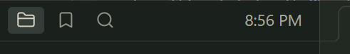
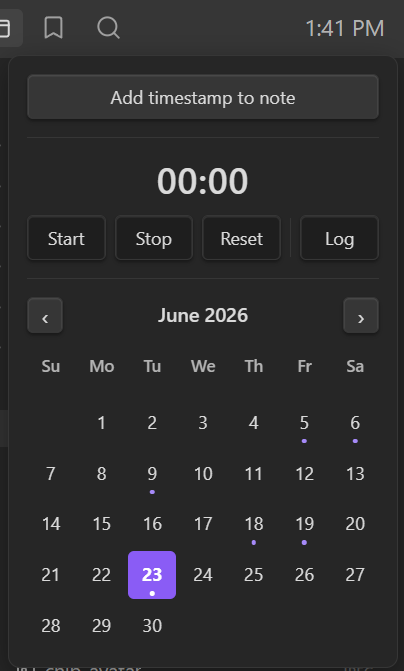
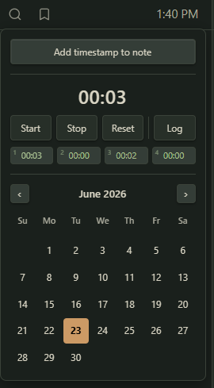

# Workspace Clock

A small clock that lives in Obsidian's left-sidebar header. Click it for a dropdown with a stopwatch, a monthly calendar wired to your daily notes, and one-click way to drop timestamps and time-tracked sessions straight into your notes.

It's styled with Obsidian's own CSS variables, no hardcoded colors, so it adopts whatever theme you're using (light or dark, sharp or rounded) and looks native on any theme.

 
## Features

- **Clock** in the sidebar header (`H:MM AM/PM`), updates every minute
- **Click → popup** with:
  - **Add timestamp to note** - drops the current time at cursor in the active note
  - **stopwatch** - Start / Stop / Reset, timestamp-based so it never drifts, plus **Log** to write the elapsed time into the daily or active note
  - **run history** - the last 4 runs as numbered chips, click one to load it back into
    the timer to resume or log it
  - **monthly calendar** wired to daily notes, click any day to open or create its note, days that already have one are dotted, today is highlighted
- **Persists across reloads** - a running stopwatch, its history, and settings all survive 
- **Theme-adaptive**: colors, accent, and corner radius all follow active theme.
- **Lightweight**: one once-per-second timer that only redraws when the minute changes. The stopwatch ticks only while it's running and the popup is open.
- Closes on outside-click or `Esc`

## Settings

**Settings → Community plugins → Workspace Clock**:

- **24-hour time** - show the clock as `HH:MM` instead of `H:MM AM/PM`
- **First day of week** - start the calendar week on Sunday or Monday
- **Timezone** - the clock follows system timezone automatically, override it to
  display a specific zone
- **Session log target** - where the **Log** button writes, daily note (default) or the active note

Daily-note features respect core Daily Note settings

## Commands

All are available in the command palette and can be assigned hotkeys:

- Toggle clock popup
- Start/stop stopwatch
- Reset stopwatch
- Add stopwatch session to note
- Insert timestamp at cursor
- Open today's daily note

## Install (Community Plugins)

1. Open **Settings → Community plugins**.
2. Turn off **Restricted mode** if it's on.
3. Select **Browse**, then search for **Workspace Clock**.
4. Select **Install**, then **Enable**.

## Install (manual)

1. Download `main.js`, `manifest.json`, and `styles.css` from the latest release.
2. Copy them into `<your-vault>/.obsidian/plugins/workspace-clock/`.
3. In Obsidian: **Settings → Community plugins → Installed plugins** enable **Workspace Clock**.

## License

[MIT](LICENSE) © toyotathief
