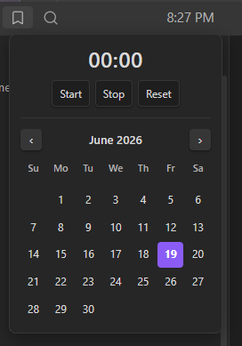
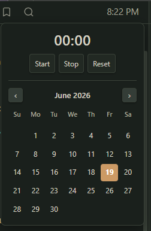

# Workspace Clock

A small clock that lives in Obsidian's left-sidebar header. Click it to open a stopwatch and a monthly calendar.

It's styled with Obsidian's own CSS variables, no hardcoded colors, so it adopts whatever theme you're using (light or dark, sharp or rounded) and looks native on any theme.

 

## Features

- **Clock** in the sidebar header (`H:MM AM/PM`), updates every minute
- **Click → popup** with:
  - a **stopwatch** — Start / Stop / Reset, timestamp-based so it never drifts
  - a **monthly calendar** — today highlighted
- Closes on outside-click or `Esc`
- **Theme-adaptive**: colors, accent, and corner radius all follow your active theme.
- **Lightweight**: one once-per-second timer that only redraws when the minute changes. The stopwatch ticks only while it's running and the popup is open.

## Install (manual)

1. Download `main.js`, `manifest.json`, and `styles.css` from the latest release.
2. Copy them into `<your-vault>/.obsidian/plugins/workspace-clock/`.
3. In Obsidian: **Settings → Community plugins → Installed plugins** enable **Workspace Clock**.

## License

[MIT](LICENSE) © toyotathief
